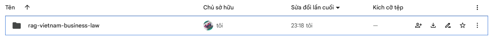
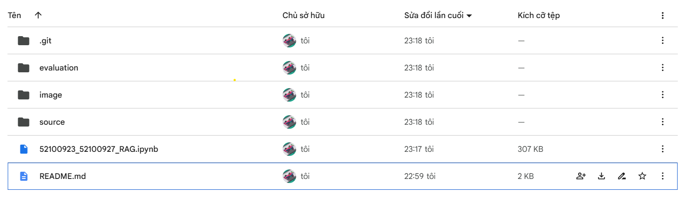
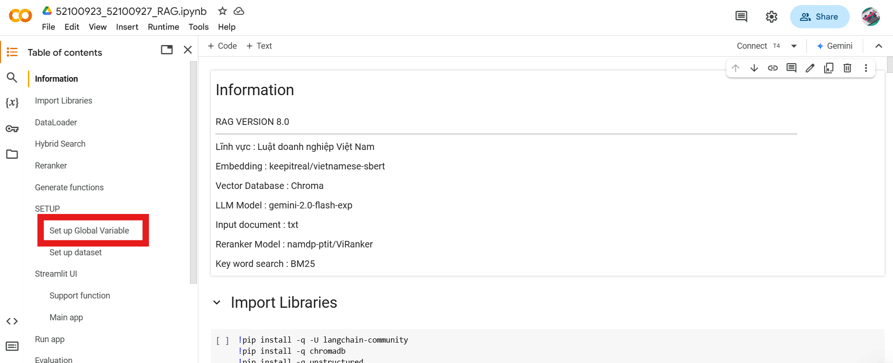
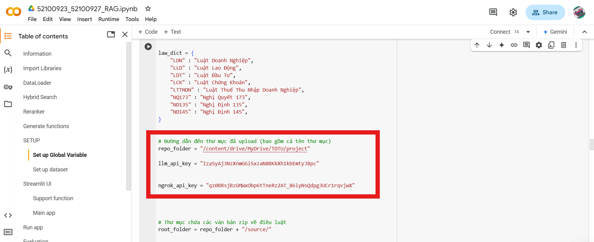
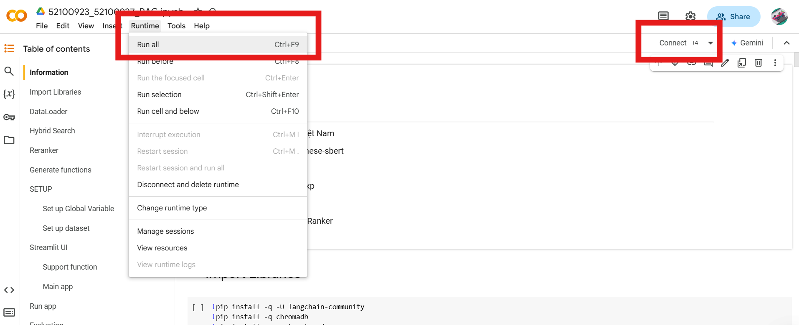
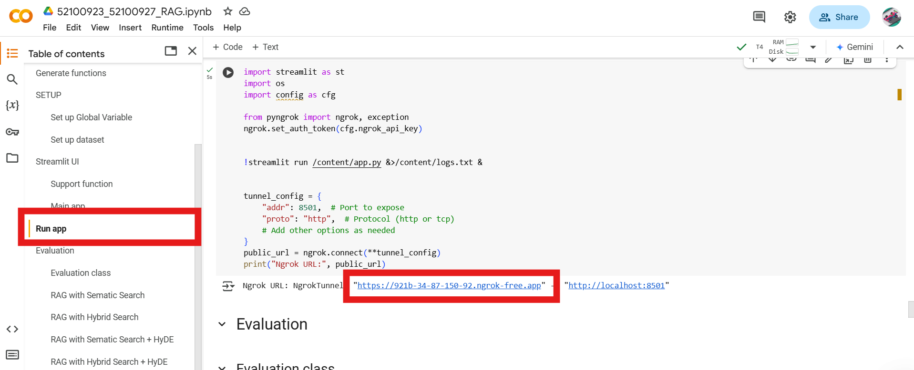
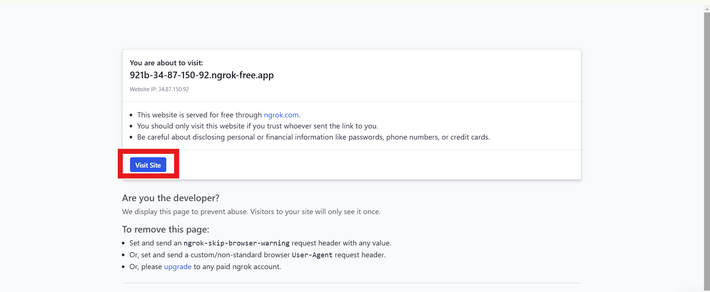
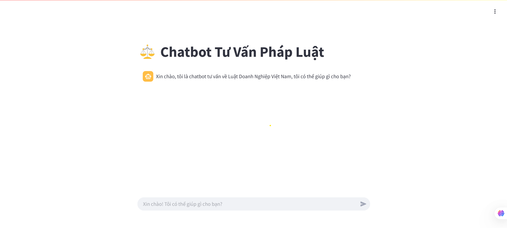
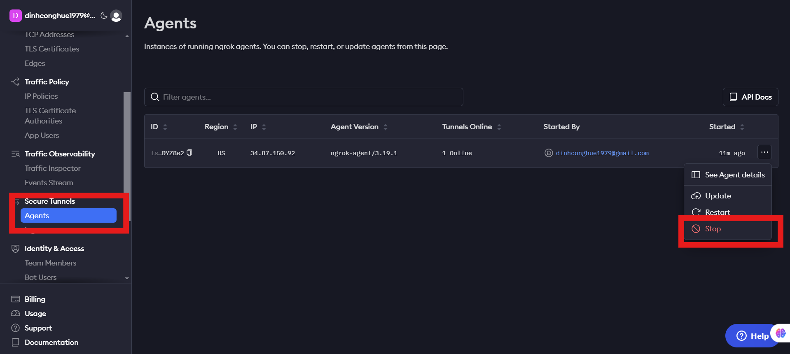

# 📌 Giới thiệu

Đây là đồ án môn **Dự án Công Nghệ Thông Tin 1** thuộc Khoa Công Nghệ Thông Tin - Đại Học Tôn Đức Thắng.

---

# 🚀 Hướng dẫn chạy code

## 🔹 Bước 1: Upload source code lên Google Drive

1. **Clone** repo này về máy:
   ```sh
   git clone <repo_url>
   ```
2. **Upload toàn bộ repo** lên Google Drive của bạn.
3. Bạn có thể **xóa file ****`.git`** trong thư mục để tăng tốc độ tải lên.




Hình ảnh bên trong folder




---

## 🔹 Bước 2: Thiết lập thông số

1. **Truy cập** vào file `52100923_52100927_RAG.ipynb` bằng Google Colab.
2. Trong phần **mục lục**, tìm đến **Set up Global Variable**.

   


3. Kéo xuống gần cuối **cell này**, bạn sẽ thấy ô màu đỏ chứa các thông số cần chỉnh sửa.

   

4. **Cập nhật các thông số sau:**
   - `repo_folder`: Đường dẫn đến thư mục chứa file trên Google Drive (*Không có dấu **`/`** cuối cùng*).
   - `llm_api_key`: API key của Google Gemini. Tạo tại [đây](https://aistudio.google.com/apikey).
   - `ngrok_api_key`: API key của Ngrok. Đăng ký tại [ngrok.com](https://ngrok.com/).

---

## 🔹 Bước 3: Chạy ứng dụng

1. **Kiểm tra GPU**:

   - Đảm bảo môi trường chạy là **T4 GPU**.
   - Nếu không đúng, vào **"Change runtime type"** để thay đổi.
   - Nếu không kết nối được GPU, sử dụng tài khoản Google khác và thực hiện lại từ đầu.

2. **Chạy toàn bộ code**:

   - Chọn **"Runtime"** → **"Run all"**.

   


3. **Mở giao diện chatbot**:
   - Sau khi code chạy xong, vào mục **"Run app"**.
   - Click vào **link Ngrok**.

   


4. **Sử dụng chatbot**:
   - Chờ 1 lúc để chatbot được load lên.
   - Sau đó, bạn có thể **sử dụng chatbot** để tư vấn pháp luật doanh nghiệp Việt Nam.

   

   


---

## ⚠️ Lưu ý quan trọng

- Sau khi sử dụng xong, vào **Ngrok** → **"Agent"** → **Kết thúc phiên chạy hiện tại**.
- Ngrok giới hạn **tối đa 3 agent** đang chạy cùng lúc cho tài khoản miễn phí.
- Nếu muốn chạy lại toàn bộ source code, hãy đảm bảo **đã dừng phiên Ngrok cũ**.

   


---

🎉 **Chúc bạn triển khai thành công!****g!** 🚀

